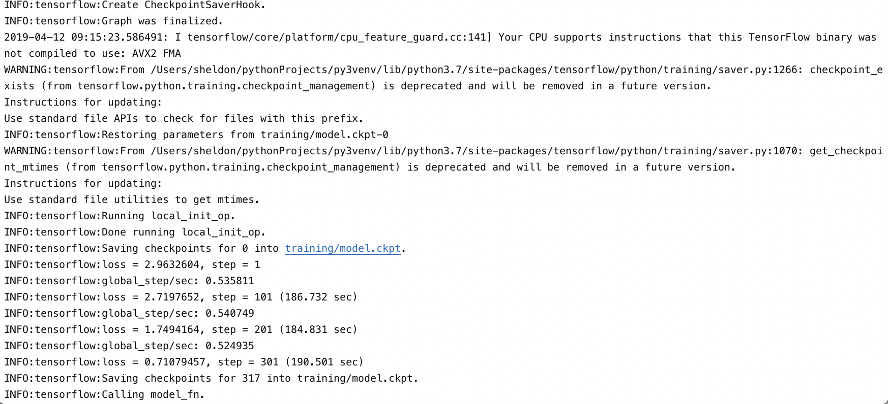
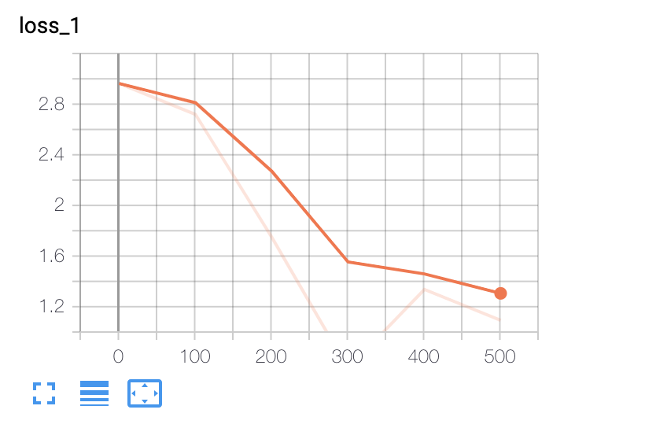
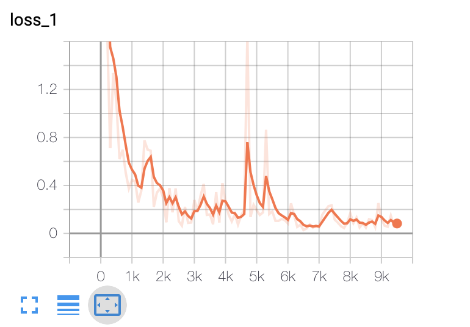
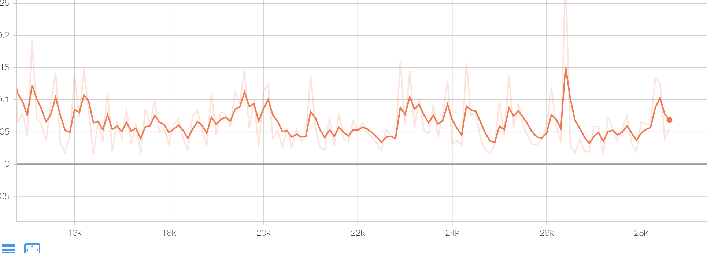
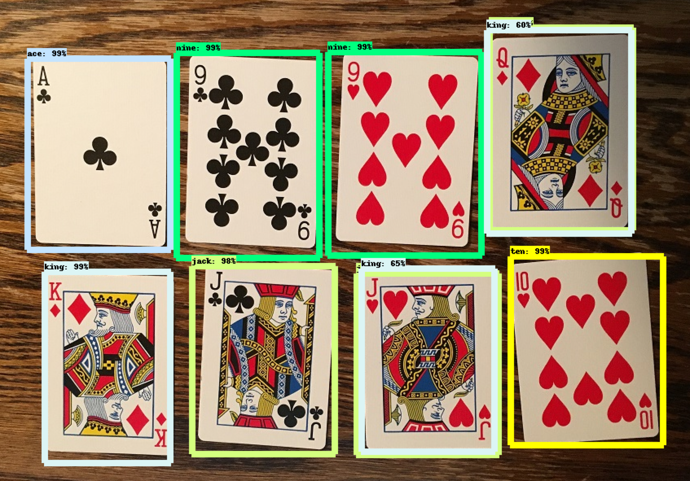

# 如何在Mac上使用TensorFlow对象识别API进行多对象识别训练？
本库fork自[TensorFlow-Object-Detection-API-Tutorial-Train-Multiple-Objects-Windows-10](https://github.com/EdjeElectronics/TensorFlow-Object-Detection-API-Tutorial-Train-Multiple-Objects-Windows-10)

## 简结
*基于TensorFlow版本1.13.1*

本库是使用TensorFlow对象识别API进行多对象识别训练在Mac上的介绍。不同的TensorFlow版本可能有微小差别，但应该都可解决。原库还有一个基于1.5版本的YouTube视频教程可以看。
**如果视频和本库有差别，已本库为准！**

[通往YouTube视频](https://www.youtube.com/watch?v=Rgpfk6eYxJA)

这个readme文件讲了如何一步步搭建并训练自己的分类器：
1. [安装TensorFlow-GPU](#1-安装TensorFlow-GPU)（Mac不支持，放弃吧~）
2. [建立工作文件夹并创建python虚拟环境](#2-建立工作文件夹并创建python虚拟环境)
3. [收集并标记图片](#3-收集并标记图片)
4. [生成训练数据](#4-生成训练数据)
5. [创建标记映射并配置模型](#5-创建标记映射并配置模型)
6. [开训](#6-开训)
7. [导出图文件](#7-导出图文件)
8. [测试](#8-测试)

[附录：常见问题](#附录：常见问题)

本库提供了完整的训练“Pinochle Deck”游戏中所用扑克牌的训练文件来训练识别九、十、钩、圈、凯、尖（游戏请自行[百度](https://www.google.com/search?q=Pinochle+Deck&oq=Pinochle+Deck&aqs=chrome..69i57j69i60.3947j0j4&sourceid=chrome&ie=UTF-8)）。并教了可用自己的文件替换3个问题来训练对象分类器，也提供了python脚本来测试图片、视频、摄像头。

## 简介
本库的目的是介绍如何从头开始训练自己的卷积神经网络多对象检测分类器。在最后会有一个程序给图片、视频、摄像头中的对象画框并标明识别结果。

网上有不少不错的类似教程，但是他们基本都是基于Linux的。原库作者的电脑是性能强劲、显卡优异的游戏PC机，装的windows系统，所以他创建了原库。

本库是基于Macos的，和Linux还是比较像的。

TensorFlow-GPU使用显卡的张量计算能力进行训练，体验很好，原库使用了。但是Mac并不支持。在他看来，使用GPU训练，加速引子可达8（也就是将CPU的计算时间从24小时缩短到3小时）。


## 步骤
### 1. 安装TensorFlow-GPU


### 2. 建立工作文件夹并创建python虚拟环境
TensorFlow Object Detection API要求使用与其GitHub库一致的目录结构。此外，还要求依赖一些额外的python包（要加到PATH或PYTHONPATH中）、使用一些额外的命令搭建环境或开始训练。

这部分指南覆盖了完整的环境搭建过程。虽然很细致了，但也要跟紧了，不然可能一步不慎，全盘报错。

#### 2a. 从GitHub下载TensorFlow Object Detection API
确定一个工作目录，比如我的是`~/pythonProjects/py3venv`。这个目录会用来存放全部TensorFlow对象识别的框架和训练图片、训练数据、训练结果、配置文件等等等等。

从 https://github.com/tensorflow/models 下载完整的库文件到工作目录并解压。会得到一个“models-master”目录，把它改名成“models”。

#### 2b. 从model zoo下载Faster-RCNN-Inception-V2-COCO模型
TensorFlow提供了很多识别模型，也就是已经用卷积神经网络训练好的分类器，就是 [model zoo](https://github.com/tensorflow/models/blob/master/research/object_detection/g3doc/detection_model_zoo.md)。一些模型识别很快但是精度较低，比如SSD-MobileNet，而有的模型精度更高但识别很慢，比如Faster-RCNN。我刚开始用的SSD-MobileNet-V1，但是识别效果一般。我又重新用Faster-RCNN-Inception-V2进行了训练，识别效果好太多了，不过也慢多了。下图是对比：

<p align="center">
  
</p>

你可以自行选择模型：如果是在移动设备上运行较低识别率（比如智能机和树莓派）可以使用SDD-MobileNet，如果要用在强劲PC上就用RCNN模型。

我后面会用Faster-RCNN-Inception-V2，[从这里下载](http://download.tensorflow.org/models/object_detection/faster_rcnn_inception_v2_coco_2018_01_28.tar.gz)，文件有140多M，看你网络。把下载文件解压到`~/pythonProjects/py3venv/models/research/object_detection`目录下：
```
xxx/object_detection>tar -xzvf faster_rcnn_inception_v2_coco_2018_01_28.tar.gz
```

#### 2c. 下载本库
把本库也下载到`~/pythonProjects/py3venv/models/research/object_detection`目录。这样目录结构就满足TensorFlow要求了。

库里包含图片、标记数据、csv文件和用于训练Pinochle Deck扑克牌的TFRcord文件。你可以用这些数据去训练其他分类器。库里还有一些python脚本可用于生成训练数据。还有个脚本是来测试训练效果的。\doc目录可以忽略，里面只是一些这个readme文件用到的图片。

如果你想自己训练，所以的文件都不用动。你可以继续往下看，就会知道哪些文件是如何生成的。不过你自己还是需要生成步骤4中的TFRecord文件：train.record和test.record。

你也可以下载我训练好的图文件，[在Dropbox上](https://www.dropbox.com/s/va9ob6wcucusse1/inference_graph.zip?dl=0)。把它解压到`\object_detection\inference_graph`中。这个图可以直接用来识别对象。你可以在完成了步骤2中的2a到2f后运行Object_detection_image.py（或video或webcam）文件测试。

如果要训练自己的识别工具，把下面的文件删掉（留着文件夹）：
- \object_detection\images\train 和 \object_detection\images\test 下面的所有文件
- \object_detection\images 下的“test_labels.csv” 和 “train_labels.csv”
- \object_detection\training 下的所有文件
-	\object_detection\inference_graph 下的所有文件

现在我们从头开始生成上面这些删掉的文件。

#### 2d. 搭建虚拟环境
接下来我们搭建一个虚拟环境，只用一条命令就可以。打开终端，执行以下命令（后面的目录要写自己的工作空间）：
```
python3 -m venv ~/pythonProjects/py3venv
```
我这里假设你用的是Python3，如果不是可以升级。升级方法参考《[Mac上安装python3最简单的方法](https://www.jianshu.com/p/be400adba577)》。

然后激活这个环境：
```
source ~/pythonProjects/py3venv/bin/activate
```
后面我们安装的所有依赖都在这个环境里，也只有这个环境能用。首先安装tensorFlow:
```
pip install tensorflow
```
然后安装protobuf:

1. https://github.com/protocolbuffers/protobuf/releases 下载
2. 解压到任意目录
3. 进入解压目录执行`./autogen.sh && ./configure && make`
4. 如果失败尝试执行`brew install autoconf && brew install automake.`然后再跑第三步
5. 执行以下命令：
```
$ make check
$ sudo make install
$ which protoc
$ protoc --version
``` 

安装其他依赖：
```
pip install --user Cython
pip install --user contextlib2
pip install --user jupyter
pip install --user matplotlib
pip install --user Cython
pip install --user contextlib2
pip install --user pillow
pip install --user lxml
pip install --user jupyter
pip install --user matplotlib
```
#### 2e. 配置PYTHONPATH环境变量
PYTHONPATH变量必须指向\models、 \models\research和 \models\research\slim。在models/目录下执行以下命令：
```
export PYTHONPATH=$PYTHONPATH:`pwd`:`pwd`/research:`pwd`/research/slim
```
如果虚拟环境重启了要重新执行该命令。

#### 2f. 编译Protobuf
接下来编译Protobuf文件，在models/research/目录执行
```
protoc object_detection/protos/*.proto --python_out=.
```
如果没有protoc命令，先安装它：
```
brew install protobuf
```
这样在\object_detection\protos下每个proto文件都生成一个pb2.py文件。

最后，在models\research目录执行下面两条命令：
```
python setup.py build
python setup.py install
```

#### 2g. 测试安装
现在环境搭建好了。由于有训练好的模型我们可以测试一下。在\object_detection下执行一下命令：
```
jupyter notebook object_detection_tutorial.ipynb
```
这会打开你的浏览器并定位到`http://localhost:8888/notebooks/object_detection_tutorial.ipynb`。点击最上面菜单栏“单元格”菜单，在下拉菜单中点击第4个“运行所有”。等一会就回有被标记的狗狗出现。
(代码会下载ssd_mobilenet_v1模型，大概80M，所以要等一会）

<p align="center">
  
</p>

### 3. 收集并标记图片
草船借箭已完成，接下来改准备火烧赤壁了。

#### 3a. 收集图片
TensorFlow需要对同一个物品的数百张图片进行处理才能得到一个较好的分类器。为了训练出来的分类器比较健壮，图片中应该包含一些其他物品，背景、光照也要不同。一些图片中的物品还需要被遮挡一点，或者只拍了一半。

我的扑克牌分类器有6种物品要识别（我不识别花色，只识别大小）。我用我手机给每张牌拍了40多张照，里面还夹杂着其他物品。然后我还拍了100多张有多张扑克牌的照片。因为我要识别被覆盖了一点的扑克，所以我的照片中也有被覆盖的。

<p align="center">
  
</p>

你可以用你的手机拍照，或者去网上下载。我觉得最少要有200张以上。我最终使用了311张图片去训练。

注意照片不要太大，200k以内就可以了。分辨率也不要超过720x1280，否则训练起来更费时间。可以使用resizer.py文件降低照片尺寸。

照片准备好后，把其中的20%放到\object_detection\images\test目录中，剩下的80%放到\object_detection\images\train下面。最好两个目录有一些照片是相同的。

#### 3b. 给图片打标记
最有意思的一部分来了！我们需要对每张图片打标记，使用的工具是LabelImg。

[LabelImg GitHub地址](https://github.com/tzutalin/labelImg)

[LabelImg下载地址](https://www.dropbox.com/s/tq7zfrcwl44vxan/windows_v1.6.0.zip?dl=1)

分别用LabelImg对\images\train和\images\test下面所有的图片进行标记，这要花点时间了...

<p align="center">
  
</p>

LabelImg的标记数据是一个xml文件，这些文件需要转换为TFRecord文件，因为TensorFlow训练的是TFRecord文件。

你可以用sizeChecker.py检测标记框是否合适。

```
python sizeChecker.py --move
```

### 4. 生成训练数据
现在要生成TFRecord文件了。我们使用两个“[Dat Tran的浣熊识别数据](https://github.com/datitran/raccoon_dataset)”提供的工具：xml_to_csv.py和generate_tfrecord.py。

先把xml转换为csv文件：
```
python xml_to_csv.py
```
这样会在\object_detection\images目录创建train_labels.csv 和 test_labels.csv两个文件

然后用csv文件通过generate_tfrecord.py生成数据。注意看下31行是否正确。里面的ID会在步骤5b中用来配置labelmap.pbtxt。

在\object_detection下面执行命令：
```
python generate_tfrecord.py --csv_input=images/train_labels.csv --image_dir=images/train --output_path=train.record
python generate_tfrecord.py --csv_input=images/test_labels.csv --image_dir=images/test --output_path=test.record
```
会生成train.record 和 a test.record两个文件。

### 5. 创建标记映射并配置模型
训练前最后一件事是创建标记映射并编辑配置文件。

#### 5a. 标记映射
标记映射用于吧ID和物品名称关联起来。在\object_detection\training文件夹下创建文本文件labelmap.pbtxt并写入以下内容：
```
item {
  id: 1
  name: 'nine'
}

item {
  id: 2
  name: 'ten'
}

item {
  id: 3
  name: 'jack'
}

item {
  id: 4
  name: 'queen'
}

item {
  id: 5
  name: 'king'
}

item {
  id: 6
  name: 'ace'
}
```
ID要和generate_tfrecord.py中定义的完全一致。

#### 5b. 配置模型
最后编辑训练参数。

把object_detection\samples\configs下面的faster_rcnn_inception_v2_pets.config文件复制到object_detection\training目录。这个文件有几处需要修改：

- 第9行num_classes，要分类的物品种数，改成6。
- 110行fine_tune_checkpoint改为：
  - fine_tune_checkpoint : "~/pythonProjects/py3venv/models/research/object_detection/faster_rcnn_inception_v2_coco_2018_01_28/model.ckpt"

- 126和128行改成：
  - input_path : "~/pythonProjects/py3venv/models/research/object_detection/train.record"
  - label_map_path: "~/pythonProjects/py3venv/models/research/object_detection/training/labelmap.pbtxt"

- 132行num_examples是\images\test下面的图片数。

- 140和142行，改成：
  - input_path : "~/pythonProjects/py3venv/models/research/object_detection/test.record"
  - label_map_path: "~/pythonProjects/py3venv/models/research/object_detection/training/labelmap.pbtxt"

现在万事俱备只欠东风了！

### 6. 开训

在\object_detection下面执行命令：
```
python model_main.py \
    --pipeline_config_path=training/faster_rcnn_inception_v2_pets.config \
    --model_dir=training \
    --alsologtostderr
```
如果报错`First step cannot be zero`，就把training/faster_rcnn_inception_v2_pets.config中的91行的schedule删掉。

笔记本上的训练很慢，何况还是没有使用GPU的情形下。

<p align="center">
  
</p>
做为对比，看一下原库的Windows下GPU训练速度，10倍的差距：
<p align="center">
  
</p>

可以使用TensorBoard看训练进度：在models\research\object_detection目录下执行
```
tensorboard --logdir=training
```
然后用浏览器打开`localhost:6006`。步数少的时候不明显

<p align="center">
  
</p>
<p align="center">
  
</p>
训练30个小时（28000多步）时，曲线变化极不明显：
<p align="center">
  
</p>
下面是原库的曲线：
<p align="center">
  
</p>

每5分钟会保存一下进程，所以你会看到生成了不少的`model.ckpt`文件。你可以中断训练过程，后面再运行的时间会继续训练。

### 7. 导出图文件
既然训练完成了，最后就该导出图了（.pb文件）。在\object_detection下执行下面的命令，用ckpt文件中的最大索引的文件去生成：
```
python export_inference_graph.py --input_type image_tensor --pipeline_config_path training/faster_rcnn_inception_v2_pets.config --trained_checkpoint_prefix training/model.ckpt-26356 --output_directory inference_graph
```
这样会在\object_detection\inference_graph下面生成`frozen_inference_graph.pb`文件，这个就是我们的产出！

### 8. 测试
现在分类器训练好了，我写了脚本用来测试识别图片、视频、摄像头。

测试前需要修改脚本中的NUM_CLASSES变量，这里是6。

测试图片的话，放一张图片到\object_detection目录，并把脚本Object_detection_image.py中的IMAGE_NAME变量改成图片名称。 直接运行文件即可。

我训练了10个小时（大概2万步）的识别结果一般：
<p align="center">
  
</p>

原库跑了3小时的训练都比我好：

<p align="center">
  
</p>


## 附录：常见问题
原库中的问题我都没有遇见。如有需求请到原库查看：
https://github.com/EdjeElectronics/TensorFlow-Object-Detection-API-Tutorial-Train-Multiple-Objects-Windows-10#appendix-common-errors